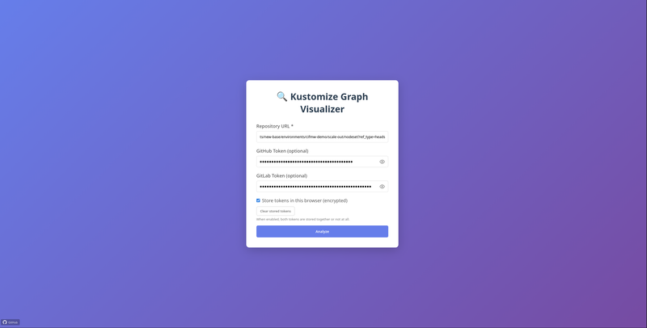
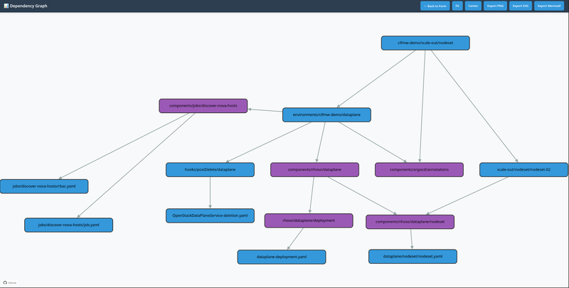
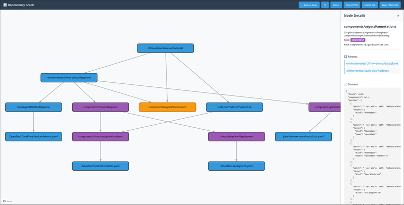

# Kustomap


A web application to visualize and explore Kustomize overlay structures in GitOps-managed environments. This is a **port of the original Node.js application to Go**, developed with the assistance of **Perplexity** and **Cursor** (AI-assisted conversion).

## Overview

- **Visual graph**: Interactive dependency tree of bases, overlays, components, and resources (Cytoscape.js in the frontend).
- **Build overlay**: In the node details sidebar (ID, Type, Path block), a *Build overlay* button is shown for overlay/resource nodes (not components). Click it to build the overlay using the kustomize library (no `kustomize` binary required) and view the resulting YAML in a fullscreen-style modal.
- **Sources**: GitHub, GitLab (URL + optional tokens), or local directory via browser File System API.
- **API**: The Go server exposes a REST API used by the web UI:
  - `POST /api/v1/analyze` — submit a repo URL (optional `github_token` / `gitlab_token`); returns a graph `id`.
  - `GET /api/v1/graph/{id}` — fetch the analyzed graph.
  - `GET /api/v1/node/{graphID}/{nodeID}` — fetch node details.
  - `POST /api/v1/node/{graphID}/{nodeID}/build` — build the overlay for that node using the kustomize Go API (same result as `kustomize build`; the kustomize binary is *not* required on the path). Optional body `{ "github_token", "gitlab_token" }`; returns `{ "yaml": "..." }`.

## Screenshots

| |
|:--:|
|  |
| *Main view — enter a repo URL and explore the overlay graph* |

| |
|:--:|
|  |
| *Graph exploration — bases, overlays, and resources* |

| |
|:--:|
|  |
| *Node details — inspect resources and manifests* |

## Prerequisites

- **Go 1.24+** (see `go.mod`)
- For container: **Docker** or **Podman**

## Install (user-level, no sudo)

Install the binary to `~/.bin` and a systemd user unit to `~/.config/systemd/user`:

```bash
make install
```

Ensure `~/.bin` is in your `PATH`. Then enable and start the user service:

```bash
systemctl --user daemon-reload
systemctl --user enable --now kustomap.service
```

Open **http://localhost:3000**. To change the port, edit `~/.config/systemd/user/kustomap.service` and add e.g. `Environment=PORT=8080` under `[Service]`, then `systemctl --user daemon-reload` and `systemctl --user restart kustomap.service`.

Uninstall:

```bash
make uninstall
```

## Build and run

### Native (Go)

```bash
git clone https://github.com/cjeanner/kustomap.git
cd kustomap

# Run directly
go run .

# Or build a kustomap binary
go build -o kustomap .

# Optional: custom port (default 3000, or set PORT)
go run . -port 8080
```

Then open **http://localhost:3000**.

### Container

```bash
# Build
podman build -t kustomap:latest -f Containerfile .
# or: docker build -t kustomap:latest -f Containerfile .

# Run (server listens on 3000 inside the container)
podman run --rm -d -p 8080:3000 --name kustomap kustomap:latest
# or: docker run --rm -d -p 8080:3000 --name kustomap kustomap:latest
```

Then open **http://localhost:8080**.

To stop and remove:

```bash
podman stop kustomap
# or: docker stop kustomap
```

## AI-assisted development

This project was created using AI tools. The **tool/AI used to port the original Node.js application to Go is Perplexity** (conversion and implementation). Ongoing development and editing use **Cursor** and its integrated AI model. The use of AI does not replace human review: all code has been reviewed and tested.

## License

This project is licensed under **Apache-2.0** — see [LICENSE](LICENSE).

### Third-party licenses

For transparency, all third-party dependencies and their licenses are listed below. This project does not modify or distribute their source; they are loaded at runtime (frontend via CDN) or linked as Go modules.

**Frontend (JavaScript, loaded in the browser):**

| Package | Version | License | Notes |
|---------|---------|---------|--------|
| [Cytoscape.js](https://github.com/cytoscape/cytoscape.js) | 3.28.1 | MIT | Graph visualization |
| [cytoscape-svg](https://github.com/kinimesi/cytoscape-svg) | 0.4.0 | **GPL-3.0** | SVG export — see note below |
| [dagre](https://github.com/dagrejs/dagre) | 0.8.5 | MIT | Graph layout |
| [cytoscape-dagre](https://github.com/cytoscape/cytoscape.js-dagre) | 2.5.0 | MIT | Dagre layout for Cytoscape |

**Backend (Go modules):**

| Package | License |
|---------|---------|
| [github.com/go-chi/chi/v5](https://github.com/go-chi/chi) | MIT |
| [github.com/google/go-github/v82](https://github.com/google/go-github) | MIT |
| [github.com/google/uuid](https://github.com/google/uuid) | BSD-3-Clause |
| [github.com/google/go-querystring](https://github.com/google/go-querystring) | BSD-3-Clause |
| [github.com/hashicorp/go-cleanhttp](https://github.com/hashicorp/go-cleanhttp) | MPL-2.0 |
| [github.com/hashicorp/go-retryablehttp](https://github.com/hashicorp/go-retryablehttp) | MPL-2.0 |
| [gitlab.com/gitlab-org/api/client-go](https://gitlab.com/gitlab-org/api/client-go) | Apache-2.0 |
| [golang.org/x/oauth2](https://pkg.go.dev/golang.org/x/oauth2) | BSD-3-Clause |
| [golang.org/x/time](https://pkg.go.dev/golang.org/x/time) | BSD-3-Clause |
| [gopkg.in/yaml.v3](https://github.com/go-yaml/yaml) | Apache-2.0 & MIT |

**Note on cytoscape-svg (GPL-3.0):** The SVG export feature uses cytoscape-svg, which is the only GPL-3.0 dependency. GPL-3.0 is not compatible with distributing a combined work under Apache-2.0 only. If you need strict Apache-2.0 compatibility (e.g. for distribution or inclusion in Apache-licensed works), be aware that using the SVG export in this application may implicate GPL-3.0 for that combined use.
